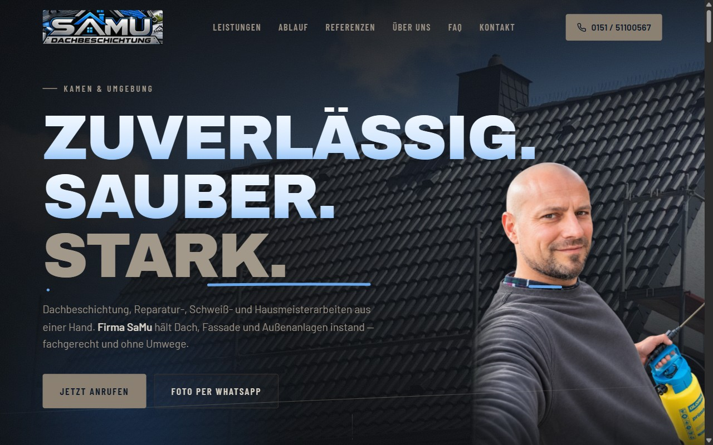
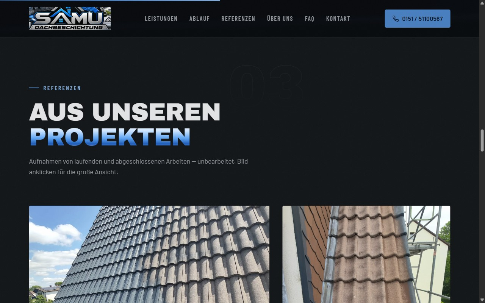
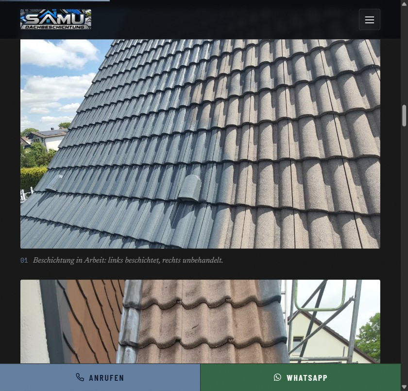

# Firmenwebsite SaMu


Statische One-Page-Firmenwebsite für einen Handwerksbetrieb (Dachbeschichtung,
Hausmeisterservice, Schweiß- und Reparaturarbeiten, Kamen). Bewusst ohne Framework,
Bundler, Backend, Cookies oder Kontaktformular gebaut — die Kernaktion des Besuchers
ist Anruf oder WhatsApp.

> **English:** Static one-page website for a crafts business — deliberately built
> without any framework, bundler, backend or cookies. Vanilla HTML/CSS/JS with a
> self-hosted GSAP scroll choreography (weld-seam scrub, coating color metaphor,
> signature self-draw), an adaptive effect budget for low-end devices, strict
> GDPR compliance (no external requests, no tracking), WCAG AA contrast and a
> self-validating single-file build (~6.6 MB, everything inlined).

**Live:** https://firmenwebsite-samu.vercel.app

| Desktop Hero | Referenzen (Editorial-Grid) | Mobil mit Callbar |
|---|---|---|
|  |  |  |

## Highlights

- **Scroll-Metapher „Beschichtung"**: Beim Scrollen interpoliert sich das gesamte
  Farbsystem von *weathered* (unbehandelt) nach *coated* (beschichtet) — quantisiert
  in 24 Stufen, DOM-Schreibzugriffe nur bei Stufenwechsel.
- **Handwerks-Motion-Design** (GSAP + ScrollTrigger, self-hosted): Schweißnaht, die
  den Ablauf per Scrub „einschweißt" (Schweißpunkt, Lichtwurf, gepoolte Funken),
  eingeschweißte Panel-Kanten, Unterschrift als Self-Draw über eine generierte
  Mittellinien-Maske (24 Striche, aus einer Raster-Vorlage vektorisiert).
- **Effekt-Budget statt Fallback**: Auf schwachen Geräten (coarse Pointer, ≤ 4 Kerne,
  ≤ 4 GB RAM) wird nur die Deko gedrosselt — Inhalte und Kernfunktionen bleiben
  identisch. Dazu: rAF-gegatete Pointer-Handler, gecachte Geometrie,
  IntersectionObserver-Pausierung abseitiger Endlosanimationen,
  `prefers-reduced-motion` vollständig abgedeckt.
- **DSGVO-hart**: Keine externen Requests — Fonts (5 Familien, woff2) und GSAP
  self-hosted, kein Tracking, keine Cookies. Der Build failt laut, wenn ein
  Google-Fonts-Request auftaucht.
- **Zugänglich**: Skip-Links, Fokus-Trap-Lightbox mit Fokus-Rückgabe, ESC-Handling,
  `aria-current`, WCAG-AA-Kontraste, semantische Heading-Struktur, FAQ als natives
  `<details>` — synchron mit dem `FAQPage`-JSON-LD.
- **SEO**: `RoofingContractor`-JSON-LD mit `areaServed`, Open Graph (1200×630),
  Sitemap/Robots, sprechende Alt-Texte (UWG-konform: Captions = tatsächlicher
  Zustand).

## Tech-Stack

Reines HTML/CSS/JS (ES5-IIFE, keine Abhängigkeiten zur Laufzeit). Build- und
Bildwerkzeuge in Python (Stdlib + Pillow):

```bash
cd site
python build_artifact.py    # erzeugt artifact.html (~6,6 MB, self-contained,
                            # inlined CSS/JS/Fonts/Bilder als data-URIs,
                            # validiert sich selbst)
python rebuild_gallery.py   # Rohfotos → optimierte WebP-Galerie (max 1600px,
                            # quality=80, löscht nie, beliebig wiederholbar)
python -m http.server       # Vorschau
```

Deploy: `vercel deploy --yes --prod` aus `site/` (`.vercelignore` hält Rohmaterial,
Werkzeuge und Secrets aus dem Upload).

## Struktur

```
site/            → Webroot (Quellen, Assets, Build- und Bildskripte)
docs/adr/        → Architecture Decision Records
docs/screenshots/
CONTEXT.md       → Domänen-Glossar (Effekt-Budget, Beschichtungs-Metapher)
AGENTS.md        → ausführliche Projekt- und Konventionsdoku
```

Private Rohdaten (unzensierte Kundenfotos, Retusche-Quellen, echte Unterschrift)
sind bewusst **nicht** im Repo — sie sind Build-Input und unterliegen dem
Datenschutz (Kennzeichen/Personen werden vor Veröffentlichung zensiert).

## Hinweis

Code gern als Referenz ansehen; Texte, Fotos, Logo und Markenauftritt gehören der
Firma SaMu und sind nicht zur Wiederverwendung freigegeben.
